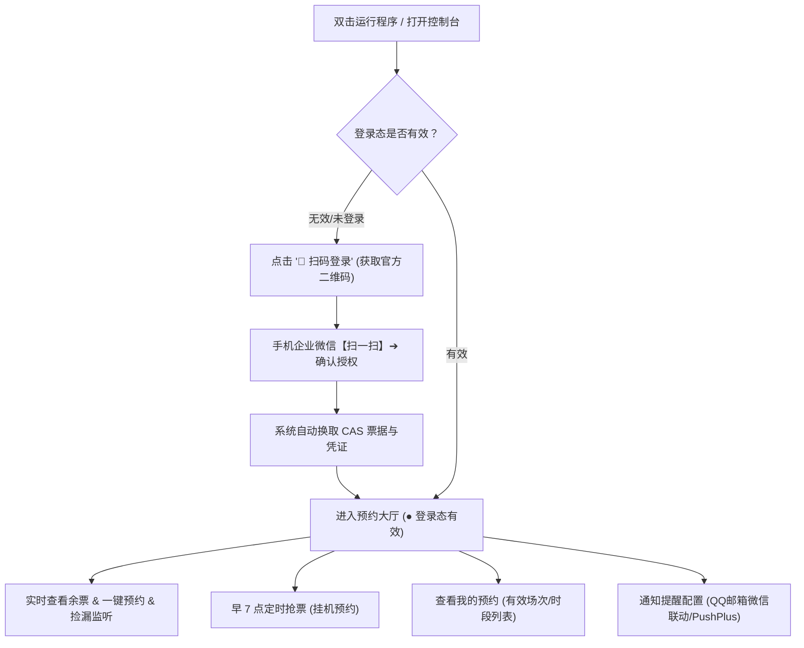

# 厦大体育馆自动预约工具 (XMU Gym Booking) 🏋️‍♂️

> 面向厦门大学师生的体育馆（翔安校区 / 思明校区健身房等）自动预约与早 7 点定时抢票辅助工具。  
> 支持**网页端直观预约**与**早 7 点定时挂机预约**，支持企业微信扫码登录，无需手动抓包。

---

## ✨ 核心功能

- 🌐 **Web 预约控制台**：浏览器端直观查看各时段已约与总名额进度条，余票状态清晰，支持点选时段即时发起预约。
- 📱 **企业微信扫码登录**：网页直接显示官方统一身份认证二维码，手机企业微信扫码确认后自动换发票据与凭证，无需手动抓包。
- 🔑 **微信小程序凭证获取**：支持通过本地代理嗅探获取小程序通信凭据并进行状态保活。
- ⏰ **早 7 点定时抢票**：支持定时挂机运行，在每日早 07:00:00 准点发起次日名额预约请求，并支持预约前自动检测登录态。
- 🎯 **备选时段自动降级**：若首选目标时段已被约满，可自动尝试预约最相邻的备选时段。
- 🔄 **余票监听捡漏**：针对已约满时段开启后台轮询监听，当有其他同学退票出现空位时自动提交预约。
- 📋 **查看我的预约**：可在控制台直接查看当前有效预约场次及历史记录，清晰展示具体日期、星期、时段与场馆场地信息。
- 🔔 **微信/邮件通知提醒**：预约成功后支持推送通知，填入 QQ 邮箱即可联动手机微信弹窗提醒，同时支持 PushPlus、Server 酱等多种通道。
- 🛡️ **配置文件容错自愈**：内置配置文件格式与缩进智能自愈机制，避免因手动编辑格式瑕疵导致程序运行异常。

---

## 🚀 两种启动方式（任选其一）

本项目提供 **「源码克隆运行」** 与 **「免安装绿色版运行」** 两种方式，请根据你的需求自由选择：

### 🌟 方式一：克隆完整代码运行（适合开发者，自己部署）

如果你习惯使用 Git 和 Python 开发环境，推荐直接克隆源码：

#### 1. 克隆代码仓库
打开命令行终端（PowerShell 或 CMD），执行：
```bash
git clone https://github.com/hechen-coder/XMU-Gym-reservation-script.git
cd XMU-Gym-reservation-script
```

#### 2. 安装 Python 依赖环境
确保已安装 Python 3.8 或更高版本（安装时请勾选 `Add Python to PATH`）。在项目根目录下安装所需依赖包：
```bash
pip install -r requirements.txt
pip install ddddocr
```
> 💡 *若下载较慢，可使用国内清华镜像源加速：*  
> `pip install -i https://pypi.tuna.tsinghua.edu.cn/simple -r requirements.txt`  
> `pip install -i https://pypi.tuna.tsinghua.edu.cn/simple ddddocr`

#### 3. 启动 Web 预约控制台
在终端中执行：
```bash
python main.py web
```
终端将启动本地服务，并在浏览器自动打开 Web 界面（默认地址：`http://localhost:8080`，扫码直达：`http://localhost:8080/login`）。
> 💡 也可以使用独立的纯扫码工具：`python cas_qr_login/run_login.py` (默认 8899 端口)

---

### 📦 方式二：直接使用 Dist 编译绿色版（小白推荐，但是需要密钥，需要联系我）

无需配置 Python 解释器和环境变量，下载解压即可直接双击运行：

#### 1. 获取解压绿色便携包
前往本项目的 **Releases 发布页面**（或直接进入项目下的 `dist/` 文件夹）：
- 下载压缩包：`XMU_Gym_Booking_v1.2.1_Portable_Windows_x64.zip`；
- 将压缩包完整解压到电脑任意文件夹（例如解压到桌面）。

#### 2. 双击运行主程序
进入解压后的文件夹，**直接双击运行 `XMU_Gym_Booking.exe`**：
- 程序将直接启动现代原生独立窗口（或自动唤醒默认浏览器打开 Web 预约控制台 `http://localhost:8080`）；
- **无需进入任何终端黑框交互菜单**，开箱即用。

---

## 📖 核心操作全流程

系统采用图形化界面设计，扫码登录后即可使用预约、定时抢票与查看预约等功能：



---

### 第一步：企业微信扫码登录

无论是直接运行 `XMU_Gym_Booking.exe` 还是通过源码 `python main.py web` 启动，系统均会打开可视化控制台（默认地址：`http://localhost:8080`）：

1. 首次打开或未登录时，直接点击顶部的 **【📱 扫码登录】**（或主界面提示卡片中的扫码按钮）；
2. 页面将直接呈现厦门大学官方统一身份认证二维码；
3. 打开手机端 **企业微信 APP**，点击右上角【+】→【扫一扫】扫描屏幕二维码，并在手机上点击【确认登录】；
4. 手机端确认后，系统自动完成 CAS 票据兑换、Token 与最新 PHPSESSID 提取并持久化写入配置，页面自动跳转进入预约大厅，顶部状态变为绿色的【● 登录态有效】。

> 💡 **说明**：  
> - 手机企业微信扫码即可授权，电脑端无需提前安装或登录微信 PC 版；  
> - 系统亦保留了【自动续登】与【微信自启动】作为高级选项，日常使用推荐扫码登录。

---

### 第二步：查看场馆余量与预约操作

登录成功后，即可在 Web 界面进行预约相关操作：

1. **实时余票查看**：
   - 界面直观展示当天与次日各时段的开放状态，包括预约时段与已约/总名额比例进度条；
   - 系统中设定的首选目标时段会带有 `⭐ 设定的目标时段` 高亮标识。
2. **一键即时预约**：
   - 看到有名额的时段，直接点击右侧绿色的 **【⚡ 立刻预约】** 按钮；
   - 程序内置本地离线验证码识别模块（基于 ddddocr），自动完成验证码识别与提交；
   - 预约完成后页面即时弹出结果提示。
3. **余票监听捡漏**：
   - 若心仪时段已被约满，可在页面下方功能栏点击 **【🎯 捡漏监听】**；
   - 系统将在后台持续轮询目标时段，一旦有其他同学退票出现空位，将自动提交预约。
4. **查看我的预约**：
   - 在页面下方功能栏点击 **【📋 我的预约】**，按钮上会实时展示当前有效预约场次数徽章；
   - 弹窗内支持在【有效预约】与【全部记录】之间一键切换；
   - 预约成功的场次会自动展示具体的日期、星期、时段以及场馆场地名称（如 `2026-09-19 周六 19:30-21:00`）；
   - 为保护个人隐私与轻量化运行，界面不生成或展示进场核销二维码（进场核销请使用学校官方小程序）。

---

### 第三步：早 7 点定时预约（挂机抢票）

厦门大学体育馆系统通常于 **每天早上 07:00:00 开放次日预约名额**。热门时段通常在较短时间内被约满。  
本工具提供定时预约调度器，睡前挂机即可在设定时间自动发起预约：

#### 1. 配置心仪时段
可直接在 Web 界面点选，或用文本编辑器打开 `config/config.yaml`（首次运行会自动生成）：
```yaml
target:
  # 改成你想预约的心仪时段 (例如 19:30-21:00 或 18:00-19:30)
  preferred_time: "19:30-21:00"

  # 1 代表预约次日票 (早 7 点抢次日名额，默认)；0 代表预约当天票
  target_date_offset: 1
```

#### 2. 启动定时挂机任务
- **网页端用户**：在页面下方功能栏直接点击 **【📅 定时预约】** 开启定时任务；
- **命令行用户**：在终端执行：
  ```bash
  python main.py schedule
  ```

---

### ⚠️ 注意事项：电脑防休眠设置指南

> [!CAUTION]
> **运行早 7 点定时抢票挂机时，电脑不能进入休眠（Sleep）或睡眠状态。**  
> 若电脑进入休眠，Windows 将中断网络连接并暂停后台程序，导致早 7 点无法正常发起预约请求。

#### ✅ 建议设置：
1. **连接电源适配器**：挂机过夜期间，建议保证笔记本电脑连接电源；
2. **关闭自动睡眠**：
   - 打开 Windows「设置」➔「系统」➔「电源和电池」；
   - 找到「屏幕和睡眠」选项；
   - 将 **「接通电源时，经过以下时间后使设备进入睡眠状态」** 设置为 **【从不】**；
3. **笔记本合盖设置**（若需要合盖）：
   - 在 Windows 控制面板的「电源选项」中，将「关闭盖子时所做的操作」设置为 **“不采取任何操作”**；
4. **支持锁屏运行**：
   - 挂机期间**可以锁屏**，按快捷键 **`Win + L`** 即可；
   - 锁屏状态下后台程序与网络均正常运行。

---

## 🔔 预约结果通知设置（可选）

预约完成后，系统支持推送结果通知。你可以在 Web 控制台的功能栏直接点击 **【🔔 通知提醒】** 进行配置与测试，也可以在 `config/config.yaml` 中修改：

### 推荐方式：QQ 邮箱 + 微信邮件提醒（便捷直达）
1. 在控制台点击 **【🔔 通知提醒】**，填入你的 **QQ 邮箱**（例如 `123456@qq.com`）并开启通知开关；
2. 手机微信开启自带的【QQ 邮箱提醒】功能（路径：微信 ➔【我】➔【设置】➔【通用】➔【辅助功能】➔【QQ 邮箱提醒】并绑定该 QQ 邮箱）；
3. 预约完成后，系统将自动向填写的邮箱发送结果邮件，手机微信将即时弹出提醒卡片；
4. 弹窗内配备 **【发送测试通知】** 按钮，点击即可快速验证邮件及微信提醒链路是否通畅。

### 其他推送渠道（高级选项）
若需要使用其他渠道，可在 `config/config.yaml` 中配置（详细模板见 `config/config.advanced.example.yaml`）：
- **PushPlus (推送加)**：配置 `channel: pushplus` 及对应的 `token`；
- **Server 酱**：配置 `serverchan` 的 `sendkey`；
- **自定义 SMTP 邮件**：配置发件服务器主机、端口与发信凭证。

---

## 🛠️ 常用命令行指令清单

除了通过 Web 界面，也可以在命令行终端使用以下指令：

| 场景功能 | 执行命令 | 功能详细说明 |
| :--- | :--- | :--- |
| **启动 Web 控制台** | `python main.py web [--port 8080]` | 启动可视化预约大厅，可指定端口 |
| **早 7 点定时抢票** | `python main.py schedule` | 准点自动预约 + 提前检测 + 备选降级 + 消息通知 |
| **退票捡漏监听** | `python main.py snipe` 或 `book --watch` | 持续轮询目标时段，检测到退票空位时自动预约 |
| **单次即时预约** | `python main.py book` | 立即发起一次目标时段预约 |
| **终端表格查余票** | `python main.py query` | 在终端以表格形式输出全天余票状态 |
| **凭证有效性自检** | `python main.py check` | 检测当前 Session 是否有效，失效自动尝试更新 |
| **HTTP 续登刷新** | `python main.py relogin` | 使用长效 Token 发起 checkLogin 刷新 Cookie |
| **启动微信嗅探** | `python main.py harvest` | 启动本地代理截获微信小程序通信凭证 |
| **Session 保活心跳** | `python main.py heartbeat` | 周期性发送心跳请求保持登录态活跃 |
| **测试消息推送** | `python main.py test-notify` | 向配置的通知渠道发送一条测试消息 |
| **测试离线 OCR** | `python main.py test-captcha` | 测试本地离线验证码识别速度与识别率 |

---

## ❓ 常见问题与避坑指南 (FAQ)

### Q1: 提示网络请求超时、连接失败或无法访问系统？
> **核心原因**：厦大体育系统接口 (`xdty.xmu.edu.cn`) 部署在校园内网。  
> - 若连接的是**校内 Wi-Fi 或有线校园网**：可直接正常使用；  
> - 若在**校外、宿舍非校园网络、或使用手机移动热点**：电脑必须提前连接 **厦大 WebVPN 或 EasyConnect 校园 VPN 客户端**！

### Q2: 提示验证码拉取或识别报错？
> 本项目使用本地离线神经网络引擎识别验证码，无需付费打码平台。请确认已正确安装 `ddddocr`：
> ```bash
> pip install ddddocr
> # 如遇安装报错或慢速，请使用 Python 3.8 ~ 3.11 环境及国内镜像源安装。
> ```
> 

### Q3: 微信小程序嗅探一直转圈或提示超时？
> 1. 请确认电脑上的 **PC 微信已登录**，且小程序能够正常打开并加载内容；  
> 2. 点击【🔑 微信嗅探】后，请在 **30 秒内**在小程序中点击【立即登录】或【场馆预约】触发数据交互；  
> 3. 若多次超时，请检查 Windows 防火墙是否放行了本地端口通信。

### Q4: 早 7 点抢票时可以合上笔记本电脑盖子吗？
> **不可以！** 除非你已在 Windows 控制面板中将「合上盖子所做的操作」设置为了「不采取任何操作」，且关闭了睡眠。我们强烈推荐接通电源、保持开盖并按 `Win + L` 锁屏挂机。

### Q5: 有其他疑问或者 bug？欢迎提交 Issues 或入群交流

> 


---

## ⚖️ 免责声明与合规公约 (Disclaimer & Ethical Use)

> [!IMPORTANT]
> **在使用、克隆、修改或运行本项目（XMU Gym Booking）之前，请务必仔细阅读并充分理解本声明全部条款。凡以任何方式直接或间接使用本项目的个人或组织，均视为自愿接受并完全遵守本声明的所有约束。若您不同意以下任何条款，请立即停止使用并删除所有相关文件。**

### 1. 🎯 技术研究与非商业用途声明
- 本项目仅供厦门大学在校师生进行 **Python 网络通信、自动化测试、非对称加密算法与异步并发任务调度等计算机科学技术的学术研究、探讨与交流学习**；
- 软件内所涉及的网络接口协议、逆向签名分析与数据交互逻辑仅供学术探讨与技术验证，任何人不得以此侵害学校、第三方服务商或他人的合法权益。

### 2. 🏛️ 校规校纪与公共资源珍惜倡议 (严防“放鸽子”与资源浪费)
- 体育馆与健身房名额属于全校师生共同享有、按需分配的珍贵公共体育资源，**请使用者务必严格遵守厦门大学体育教学与场馆管理相关规章制度**；
- **坚决杜绝恶意占座与爽约（“放鸽子”）行为**：
  - 严禁预约成功后无故不到场锻炼；
  - 根据厦门大学场馆管理官方规定：**若一周内累计 2 次爽约未到场核销，系统将直接将该账号拉入黑名单，并限制后续一切场馆预约资格**；
  - 若您的日常日程或运动计划临时发生变动，**请务必至少提前 1 小时在官方小程序或本项目控制台内主动取消预约**，将宝贵的名额第一时间释放给其他有锻炼需求的师生。

### 3. 🛡️ 网络安全、防滥用与非过载原则
- **严禁恶意高频刷票与拒绝服务攻击**：本工具默认内置了严格的请求频率控制、网络 RTT 延迟补偿与防风控机制。使用者**严禁恶意修改请求频率参数以发起高并发突发请求或拒绝服务式（DoS）攻击**，绝不得对校方服务器与校园网造成非理性的负载冲击或运行干扰；
- **防作弊与公平使用倡议**：严禁利用本工具进行垄断占场、大批量囤积时段或妨碍他人正常预约；
- 若使用者因人为违规修改参数、恶意高频并发而导致 IP 被封禁、校园网统一认证账号受限、被学校通报批评或面临其他法律责任，**均由使用者本人独立承担全部后果，与本软件开发者及贡献者概无任何连带责任**。

### 4. 🔒 个人隐私保护与本地凭证安全说明
- 本工具为**完全本地化运行的纯客户端开源程序**，所有网络请求均直接在用户本地计算机与校方官方服务器（`ids.xmu.edu.cn` 与 `xdty.xmu.edu.cn`）之间端到端建立；
- **零数据回传与隐私安全承诺**：本程序绝不收集、不记录、不上传任何用户的学号、密码、Token、Session、Cookie 或设备硬件识别码至任何第三方云端或私人服务器；
- 用户因自身电脑环境安全缺陷（如遭受木马病毒窃听）、随意分享包含敏感私钥或配置的文件（如 `config.yaml`、`tools/*.pem`）所导致的信息泄露、财产损失或法律纠纷，开发者概不承担任何责任。

### 5. ⚠️ 免责条款与无担保原则 (AS-IS)
- 本软件代码按“现状 (AS-IS)”提供，**开发者不就软件的适用性、稳定性、准点抢票绝对成功率提供任何明示或暗示的保证**；
- 体育馆预约受校园网链路质量、校园 VPN (EasyConnect/WebVPN) 稳定性、学校服务器承载瞬时峰值、数据库高并发锁表及不可预测的接口升级等多种客观外界因素影响，开发者对于因抢票失败、时段被占、网络超时等原因导致的任何直接、间接或附带损失，均不承担任何赔偿或连带法律责任。

### 6. 🛑 权利保留与协同处置
- 若厦门大学相关职能部门、系统版权所有方或运营单位认为本项目存在不妥之处或违反有关信息化管理规范，请通过 GitHub Issue 或电子邮件联系作者，开发者将本着维护校园网络安全与和谐秩序的原则，第一时间积极响应、配合整改或下架相关内容。