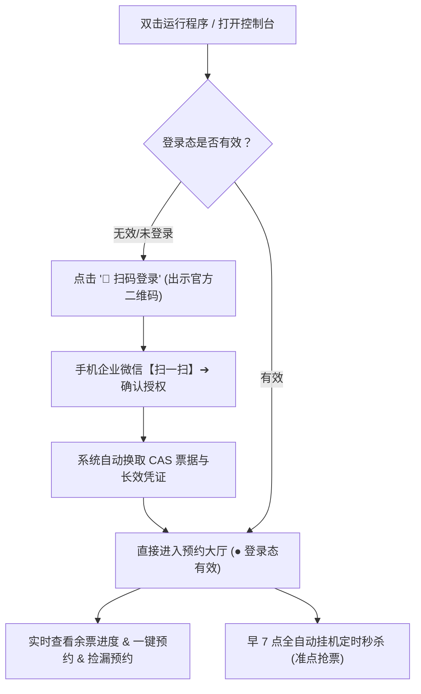

# 厦大体育馆自动预约工具 (XMU Gym Booking) 🏋️‍♂️

> 面向厦门大学师生的体育馆（翔安校区 / 思明校区健身房等）极速预约与早 7 点准点抢票工具。  
> **无需复杂抓包**，支持**网页直观预约**与**早 7 点全自动挂机秒抢**，零编程基础也能轻松上手！

---

## ✨ 核心功能亮点

- 🌐 **现代化 Web 控制台**：浏览器直观查看全天各时段已约/总名额进度条，余票状态一目了然，点选时段毫秒级一键预约。
- 📱 **纯 Python 企业微信扫码直通**：彻底脱离微信 PC 客户端与手动抓包！浏览器直出官方二维码，手机扫码授权后系统自动换发 ST 票据与长效凭证，自动持久化并直通预约大厅。
- 🔑 **微信免抓包智能嗅探**：支持本地代理安全嗅探，微信小程序点击即自动提取凭证并持久保活，告别手动抓包看 Cookie。
- ⏰ **早 7 点全自动秒杀抢票**：睡前挂机，次日早 06:55 自动自检自愈登录态，07:00:00 准点毫秒级并发秒抢次日名额。
- 🎯 **就近时段智能降级保护**：若首选黄金时段瞬间被抢空，算法自动就近抢最相邻的可用时段，绝不空手而归。
- 🔄 **退票捡漏秒级回捞**：热门时段已约满？开启捡漏监听模式，一旦有人退票出空位立即毫秒级自动秒抢。
- 📱 **微信即时推送提醒**：抢票成功后手机微信秒弹卡片通知，场馆、日期、时段清晰呈现。

---

## 🚀 两种启动方式（任选其一）

本项目提供 **「源码克隆运行」** 与 **「免安装绿色版运行」** 两种方式，请根据你的需求自由选择：

### 🌟 方式一：克隆完整代码运行（适合开发者，自己部署）

如果你习惯使用 Git 和 Python 开发环境，推荐直接克隆源码：

#### 1. 克隆代码仓库
打开命令行终端（PowerShell 或 CMD），执行：
```bash
git clone https://github.com/hechen-coder/XMU-Gym-reservation-script.git
cd XMU-Gym-reservation-script
```

#### 2. 安装 Python 依赖环境
确保已安装 Python 3.8 或更高版本（安装时请务必勾选 `Add Python to PATH`）。在项目根目录下安装所需依赖包：
```bash
pip install -r requirements.txt
pip install ddddocr
```
> 💡 *若下载较慢，可使用国内清华镜像源加速：*  
> `pip install -i https://pypi.tuna.tsinghua.edu.cn/simple -r requirements.txt`  
> `pip install -i https://pypi.tuna.tsinghua.edu.cn/simple ddddocr`

#### 3. 启动 Web 预约控制台
在终端中执行：
```bash
python main.py web
```
终端将启动本地服务，并在浏览器自动打开 Web 界面（默认地址：`http://localhost:8080`，扫码直达：`http://localhost:8080/login`）。
> 💡 也可以使用独立的纯扫码工具：`python cas_qr_login/run_login.py` (默认 8899 端口)

---

### 📦 方式二：直接使用 Dist 编译绿色版（小白推荐，但是需要密钥，需要联系我）

无需配置 Python 解释器和环境变量，下载解压即可直接双击运行：

#### 1. 获取解压绿色便携包
前往本项目的 **Releases 发布页面**（或直接进入项目下的 `dist/` 文件夹）：
- 下载压缩包：`XMU_Gym_Booking_v1.2.1_Portable_Windows_x64.zip`；
- 将压缩包完整解压到电脑任意文件夹（例如解压到桌面）。

#### 2. 双击运行主程序
进入解压后的文件夹，**直接双击运行 `XMU_Gym_Booking.exe`**：
- 程序将直接启动现代原生独立窗口（或自动唤醒默认浏览器打开 Web 预约控制台 `http://localhost:8080`）；
- **无需进入任何终端黑框交互菜单**，零命令、开箱即用！

---

## 📖 核心操作全流程（极简三步上手）

系统采用全图形化设计，无需任何复杂配置，**仅需扫码一次即可直通预约与挂机秒杀**：



---

### 第一步：企业微信扫码登录（一键秒达 · 推荐）

无论是直接双击 `XMU_Gym_Booking.exe` 还是通过源码 `python main.py web`，系统均会直接呈现可视化控制台（`http://localhost:8080`）：

1. 首次打开或未登录时，直接点击顶部的 **【📱 扫码登录】**（或提示卡片中的扫码按钮）；
2. 页面将直接呈现厦门大学官方统一身份认证二维码；
3. 打开手机端 **企业微信 APP**，点击右上角【+】→【扫一扫】扫描屏幕二维码，并在手机上点击【确认登录】；
4. 手机端点击确认后，系统在 1 秒内自动完成 CAS 票据兑换、Token 与最新 PHPSESSID 提取并自动写入配置，**页面自动跳转进入预约大厅，顶部状态变为绿色的【● 登录态有效】**！

> 💡 **扫码直登优势**：  
> - **零客户端依赖**：电脑上无需安装微信 PC 版，手机企业微信扫码即可授权；  
> - **免小程序点击**：扫码确认后即可直接选场预约，**全程无需在电脑微信小程序中点击“立即登录”或“场馆预约”**，真正做到 3 秒极速直达！

*(注：系统亦保留了【⚡  自动续登】与【🔑 微信自启动】作为高级选项，日常使用仅需扫码登录即可。)*

---

### 第二步：实时查看场馆余量与一键即时预约

凭据捕获成功后，即可在 Web 界面上享受极致便捷的预约体验：

1. **实时余票一览**：Web 界面直观展示当天与次日各时段的开放状态，包括：
   - 预约日期与时段（如 `18:00-19:30`、`19:30-21:00`）；
   - 已约人数 / 总名额实时比例进度条（绿色表示名额充足，黄色表示名额紧张，红色表示已满）；
   - 系统设置的目标黄金时段会带有 `⭐ 设定的目标时段` 高亮标识。
2. **一键极速预约**：
   - 看到有名额的时段，直接点击右侧绿色的 **【⚡ 立刻预约】** 按钮；
   - 程序内置本地高精度离线 OCR 验证码识别引擎（毫秒级出图即解），并在 0.1 秒内自动完成验证码提交与场馆锁定！
   - 预约成功后，页面即时弹出确认提示框。

> 💡 **极速秒约体验**：  
> 网页端采用异步响应式设计，点击预约瞬间自动并行完成「拉取防刷验证码 ➔ 本地离线神经网络识别 ➔ 构造加密载荷提交」，全程耗时通常在 100~200ms 内，快人一步！

---

### 第三步：早 7 点全自动定时抢票（早起挂机秒杀神器）

厦门大学体育馆系统固定于 **每天早上 07:00:00 准点开放次日预约名额**。热门黄金时段（如 18:00-19:30、19:30-21:00）通常在数秒内被抢空。  
本工具专门打造了全自动定时秒杀调度器，只需在睡前挂机即可安心坐等抢票成功！

#### 1. 配置心仪时段
用记事本或文本编辑器打开 `config/config.yaml`（首次运行程序会自动生成）：
```yaml
target:
  # 改成你想预约的心仪时段 (例如 19:30-21:00 或 18:00-19:30)
  preferred_time: "19:30-21:00"

  # 1 代表预约次日票(默认，早7点抢次日名额)；0 代表预约当天票
  target_date_offset: 1
```

#### 2. 启动定时挂机任务
- **绿色版用户**：直接页面的下方自动化功能栏点击定时预约：

  

- **源码用户**：在终端中输入下方命令，或者在web页面使用定时预约功能
  
  ```bash
  python main.py schedule
  ```

---

### ⚠️ 重中之重：电脑防休眠设置指南

> [!CAUTION]
> **运行早 7 点定时抢票挂机时，电脑绝对不能进入休眠（Sleep）或睡眠状态！**  
> 一旦电脑休眠，Windows 将断开 Wi-Fi 网络连接并挂起所有正在运行的后台程序，导致早 7 点无法准时发起网络请求而抢票失败！

#### ✅ 正确做法：
1. **插上电源适配器**：挂机过夜期间，请务必保证笔记本电脑连接电源；
2. **关闭系统自动睡眠**：
   - 打开 Windows「设置」➔「系统」➔「电源和电池」；
   - 找到「屏幕和睡眠」选项；
   - 将 **「接通电源时，经过以下时间后使设备进入睡眠状态」** 设置为 **【从不】**！
3. **笔记本防合盖休眠**（若需要合上笔记本）：
   - 在 Windows 控制面板的「电源选项」中，将「关闭盖子时所做的操作」设置为 **“不采取任何操作”**。
4. **支持安全锁屏**：
   - 挂机期间**完全可以锁屏**！直接按键盘快捷键 **`Win + L`** 锁屏即可；
   - 锁屏状态下后台程序与网络均正常运行，既能保护隐私，又能保障次日预约正常工作！

---

## 📱 接收微信抢票成功提醒 (可选，1分钟完成)

想在早上躺在床上就能第一时间知道抢票结果？建议配置免费的微信消息推送：

1. 打开微信，扫码登录免费的 [PushPlus (推送加) 官网 ](https://www.pushplus.plus/) （这个网站实名认证得充钱3.9r  真keng）或者配置邮件 SMTP、Server酱等；
2. 登录后在网站右上角复制你的 **Token**（一串英文字符）；
3. 打开项目中的 `config/config.yaml`，填入下方配置：
   ```yaml
   notify:
     enabled: true
     channel: "pushplus"
     pushplus_token: "你的PushPlus_Token填在这里"
   ```

---

## 🛠️ 常用进阶命令清单 (CLI 极客指南)

除了通过 Web 界面和批处理，你也可以直接在命令行终端使用以下完整指令：

| 场景功能 | 执行命令 | 功能详细说明 |
| :--- | :--- | :--- |
| **启动 Web 控制台** | `python main.py web [--port 8080]` | 启动可视化监控大厅，可指定端口 |
| **早 7 点挂机秒杀** | `python main.py schedule` | 准点自动抢票 + 提前自检 + 就近降级 + 微信通知 |
| **退票捡漏监听** | `python main.py snipe` 或 `book --watch` | 持续毫秒级轮询，有人退票瞬间自动秒抢 |
| **单次即时预约** | `python main.py book` | 立即发起一次目标时段预约测试 |
| **终端表格查余票** | `python main.py query` | 在终端以整齐表格形式输出全天余票信息 |
| **凭证有效性自检** | `python main.py check` | 检测当前 Session 是否有效，失效自动尝试自愈 |
| **HTTP 一键续登** | `python main.py relogin` | 使用长效 Token 发起纯 HTTP checkLogin 刷新 Cookie |
| **启动微信嗅探** | `python main.py harvest` | 启动本地代理截获微信小程序通信凭证 |
| **Session 保活心跳** | `python main.py heartbeat` | 周期性发送轻量心跳请求防止 Cookie 超时 |
| **测试微信推送** | `python main.py test-notify` | 向绑定的微信发送一条测试消息卡片 |
| **测试离线 OCR** | `python main.py test-captcha` | 测试本地离线验证码识别速度与识别率 |

---

## ❓ 常见问题与避坑指南 (FAQ)

### Q1: 提示网络请求超时、连接失败或无法访问系统？
> **核心原因**：厦大体育系统接口 (`xdty.xmu.edu.cn`) 部署在校园内网。  
> - 若连接的是**校内 Wi-Fi 或有线校园网**：可直接正常使用；  
> - 若在**校外、宿舍非校园网络、或使用手机移动热点**：电脑必须提前连接 **厦大 WebVPN 或 EasyConnect 校园 VPN 客户端**！

### Q2: 提示验证码拉取或识别报错？
> 本项目使用本地离线神经网络引擎识别验证码，无需付费打码平台。请确认已正确安装 `ddddocr`：
> ```bash
> pip install ddddocr
> # 如遇安装报错或慢速，请使用 Python 3.8 ~ 3.11 环境及国内镜像源安装。
> ```
> 

### Q3: 微信小程序嗅探一直转圈或提示超时？
> 1. 请确认电脑上的 **PC 微信已登录**，且小程序能够正常打开并加载内容；  
> 2. 点击【🔑 微信嗅探】后，请在 **30 秒内**在小程序中点击【立即登录】或【场馆预约】触发数据交互；  
> 3. 若多次超时，请检查 Windows 防火墙是否放行了本地端口通信。

### Q4: 早 7 点抢票时可以合上笔记本电脑盖子吗？
> **不可以！** 除非你已在 Windows 控制面板中将「合上盖子所做的操作」设置为了「不采取任何操作」，且关闭了睡眠。我们强烈推荐接通电源、保持开盖并按 `Win + L` 锁屏挂机。

### Q5: 有其他疑问或者bug？欢迎提交isuues或者入群交流

> 


---

## ⚖️ 免责声明与合规公约 (Disclaimer & Ethical Use)

> [!IMPORTANT]
> **在使用、克隆、修改或运行本项目（XMU Gym Booking）之前，请务必仔细阅读并充分理解本声明全部条款。凡以任何方式直接或间接使用本项目的个人或组织，均视为自愿接受并完全遵守本声明的所有约束。若您不同意以下任何条款，请立即停止使用并删除所有相关文件。**

### 1. 🎯 技术研究与非商业用途声明
- 本项目仅供厦门大学在校师生进行 **Python 网络通信、自动化测试、非对称加密算法与异步并发任务调度等计算机科学技术的学术研究、探讨与交流学习**；
- 软件内所涉及的网络接口协议、逆向签名分析与数据交互逻辑仅供学术探讨与技术验证，任何人不得以此侵害学校、第三方服务商或他人的合法权益。

### 2. 🏛️ 校规校纪与公共资源珍惜倡议 (严防“放鸽子”与资源浪费)
- 体育馆与健身房名额属于全校师生共同享有、按需分配的珍贵公共体育资源，**请使用者务必严格遵守厦门大学体育教学与场馆管理相关规章制度**；
- **坚决杜绝恶意占座与爽约（“放鸽子”）行为**：
  - 严禁预约成功后无故不到场锻炼；
  - 根据厦门大学场馆管理官方规定：**若一周内累计 2 次爽约未到场核销，系统将直接将该账号拉入黑名单，并限制后续一切场馆预约资格**；
  - 若您的日常日程或运动计划临时发生变动，**请务必至少提前 1 小时在官方小程序或本项目控制台内主动取消预约**，将宝贵的名额第一时间释放给其他有锻炼需求的师生。

### 3. 🛡️ 网络安全、防滥用与非过载原则
- **严禁恶意高频刷票与拒绝服务攻击**：本工具默认内置了严格的请求频率控制、网络 RTT 延迟补偿与防风控机制。使用者**严禁恶意修改请求频率参数以发起高并发突发请求或拒绝服务式（DoS）攻击**，绝不得对校方服务器与校园网造成非理性的负载冲击或运行干扰；
- **防作弊与公平使用倡议**：严禁利用本工具进行垄断占场、大批量囤积时段或妨碍他人正常预约；
- 若使用者因人为违规修改参数、恶意高频并发而导致 IP 被封禁、校园网统一认证账号受限、被学校通报批评或面临其他法律责任，**均由使用者本人独立承担全部后果，与本软件开发者及贡献者概无任何连带责任**。

### 4. 🔒 个人隐私保护与本地凭证安全说明
- 本工具为**完全本地化运行的纯客户端开源程序**，所有网络请求均直接在用户本地计算机与校方官方服务器（`ids.xmu.edu.cn` 与 `xdty.xmu.edu.cn`）之间端到端建立；
- **零数据回传与隐私安全承诺**：本程序绝不收集、不记录、不上传任何用户的学号、密码、Token、Session、Cookie 或设备硬件识别码至任何第三方云端或私人服务器；
- 用户因自身电脑环境安全缺陷（如遭受木马病毒窃听）、随意分享包含敏感私钥或配置的文件（如 `config.yaml`、`tools/*.pem`）所导致的信息泄露、财产损失或法律纠纷，开发者概不承担任何责任。

### 5. ⚠️ 免责条款与无担保原则 (AS-IS)
- 本软件代码按“现状 (AS-IS)”提供，**开发者不就软件的适用性、稳定性、准点抢票绝对成功率提供任何明示或暗示的保证**；
- 体育馆预约受校园网链路质量、校园 VPN (EasyConnect/WebVPN) 稳定性、学校服务器承载瞬时峰值、数据库高并发锁表及不可预测的接口升级等多种客观外界因素影响，开发者对于因抢票失败、时段被占、网络超时等原因导致的任何直接、间接或附带损失，均不承担任何赔偿或连带法律责任。

### 6. 🛑 权利保留与协同处置
- 若厦门大学相关职能部门、系统版权所有方或运营单位认为本项目存在不妥之处或违反有关信息化管理规范，请通过 GitHub Issue 或电子邮件联系作者，开发者将本着维护校园网络安全与和谐秩序的原则，第一时间积极响应、配合整改或下架相关内容。